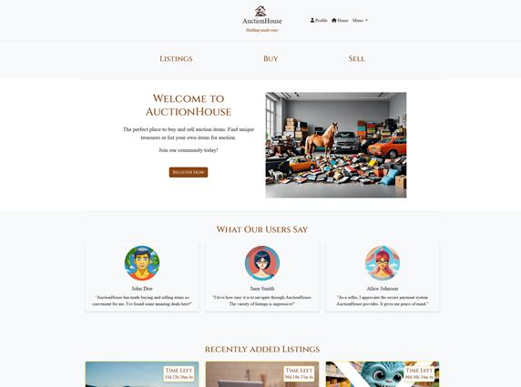

# SemesterProject2

## Auction House



# Description

This project is an Auction House web application created as a part of Noroff online studies, where users who has a noroff student email can list items for auction, bid on items, and manage their listings.

### Goal

The primary goal of SemesterProject2 is to apply the knowledge and skills acquired throughout the semester to develop a fully functional auction website. This project serves as an opportunity to demonstrate proficiency in web development concepts such as HTML, CSS, JavaScript, front-end frameworks like Bootstrap, back-end server interactions, user authentication, database management, and responsive design.

## Features

- User Authentication: Users can create accounts, log in, and log out.
- Listings: Users can create listings for items they want to sell.
- Bidding: Users can place bids on listed items.
- Search: registered and unregistered users can search for listings based on keywords or tags.
- Sorting and Filtering: Listings can be sorted and filtered based on various criteria.
- Profile Management: Registered users can view and manage their profile information and listings.
- Responsive Design: The application is responsive and works well on various devices.

## Built With

- HTML
- Bootstrap
- SCSS
- JavaScript

## Getting Started

### Prerequisites

    Node.js installed on your machine
    npm package manager

### Installing

1. Clone the repo:

```bash
git clone https://github.com/IceGreenGalactic/semesterProject2
```

2. Install the dependencies:

```
npm install
```

## Building

To build the project for production:

```bash
npm run build
```

## Linting

To lint JavaScript files:

```bash
npm run lint
```

This will run ESLint to check for syntax errors and coding style violations.

## Usage

    Register for an account or log in if you already have one.
    Explore listings, place bids, or create your own listings.
    Manage your profile and listings.

## Trello

- https://trello.com/invite/b/nODiemtr/ATTI63df04b4b3ec4766dba1e49b0ec6275cB51854C1/semesterproject2

## Contact

- [My LinkedIn page](https://www.linkedin.com/in/kristine-tyrholm-7902172a4)
- [My Portforlio](https://kristine-tyrholm.netlify.app/)
